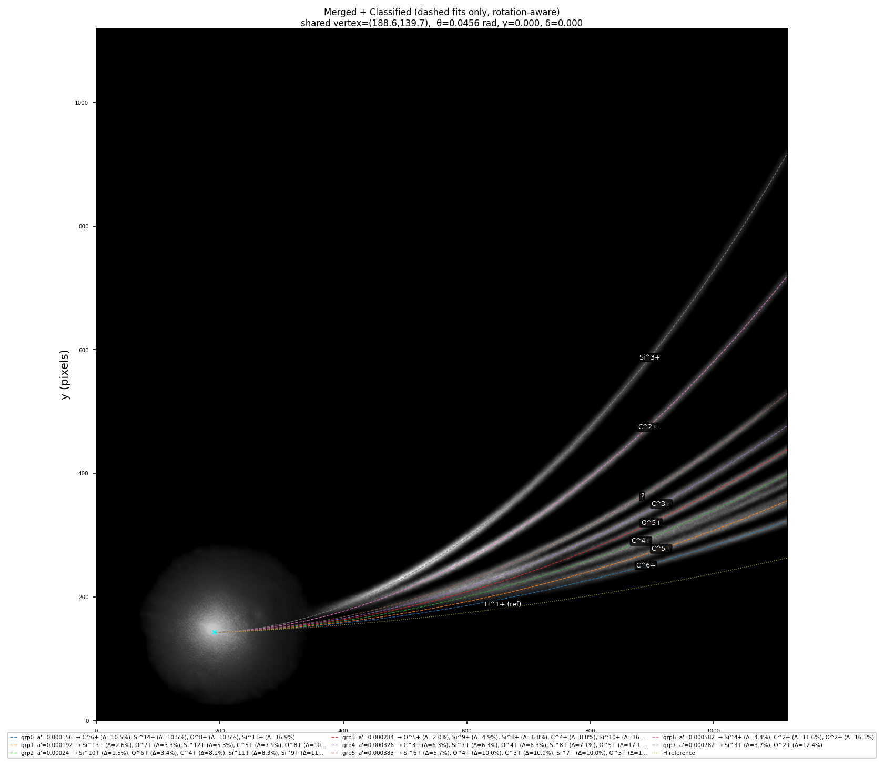

# Oblisk

Oblisk is an end-to-end Thomson parabola spectrometer analysis repository.

Web version can be accessed at: https://thomson-parabolas.shelamanov.com

The main runtime path is:

1. load a detector image
2. crop the active detector region with YOLO
3. denoise with UNet or morphological opening
4. detect and merge trace candidates
5. fit shared geometry and classify species
6. build spectra and export plots plus `res.json`

## Quickstart

Create the local environment and install dependencies:

```bash
bash setup.sh
source venv/bin/activate
```

Run one image through the CLI (`example.png` in the repo root is a synthetic detector render you can use out of the box):

```bash
python main.py example.png --output-dir outputs --add-plots
```

### Example synthetic image and classification

The figures below come from running the command above on `example.png`. The second image is the pipeline’s merged-and-classified view with dashed geometric fits over the denoised, rotation-corrected view.

**Example of synthetic image**


**Example of classification** (merged traces, dashed fitted parabolas, species labels)



## Inputs And Models

- `eval_synth/` is the broader synthetic evaluation dataset generated from `synthetic_data/`.
- The runtime expects the detector model at `yolo-tune/thomson-cutter.onnx` and the UNet checkpoint at `unet-denoiser/unet_denoise_best.pth` by default.
- Those runtime model paths can be overridden with `OBLISK_YOLO_MODEL_PATH` and `OBLISK_UNET_CHECKPOINT_PATH`.
- While decision to keep models in the repository and git isn't exactly a best practice, introducing a proper model tracking and versioning framework would take a lot of time, but wouldn't bring any major improvements. The models are not going to be updated often, so they are kept as plain files.

## Outputs

For a single-image run, the output directory contains:

- `res.json`: structured result payload with classifications, spectra, timings, and evaluation summaries
- `plots/`: diagnostic PNGs when `--add-plots` or `--add-plots-full` is used

For batch runs, the CLI also writes batch summary material under the chosen output directory.

## Testing

Run the full pytest suite (non-interactive matplotlib backend, venv activated):

```bash
bash test.sh
```

End-to-end coverage includes `synthetic_data/detector_image.png` (gitignored until you generate it). Create or refresh that file with:

```bash
bash synthetic_data/generate_image.sh
```

Type-checking and linting are separate: `./mypy.sh` and `flake8 .`. Tests marked optional `integration` skip when matching local fixture data is absent.

## Web App

The browser UI lives under `web/` and uses the same core Python package. The backend is in `web/backend/` and the frontend is in `web/frontend/`.

## Repository Layout

- `main.py`: thin entrypoint that calls `oblisk.cli.main`
- `oblisk/`: main Python package for runtime analysis, preprocessing, reporting, and shared services
  - `analysis/`: physics and energy mapping, geometry fitting, trace detection, spectra, classification
  - `processing/`: preprocessing, pipeline orchestration (`pipeline*.py`), morphological and line helpers
  - `reporting/`: `res.json` models, batch summaries, evaluation reports
  - `cli.py`, `config.py`, `runtime.py`: CLI, defaults, and high-level run wiring
  - `runtime_yolo.py` / `runtime_unet.py`: ONNX YOLO crop and UNet denoise inference
- `tests/`: unit, smoke, synthetic-regression, and integration coverage
- `docs/`: pipeline notes, subsystem docs, and supporting material
- `synthetic_data/`: C++ Monte Carlo tracker, Python dataset tools, and `synthetic_data/utils/` (noise and hit rasterization)
- `unet-denoiser/`: UNet training workflow and checkpoints (`train.py`, notebook, training `utils/`)
- `yolo-tune/`: detector-model training assets and exported ONNX runtime model
- `web/`: FastAPI backend (`web/backend/`) and Vite frontend (`web/frontend/`), plus `web/tests/` for e2e
- `eval_synth/`: local synthetic evaluation dataset (optional; generated)
- `outputs/`: example CLI output (not authoritative; your runs go where you point `--output-dir`)

## More Detail

Start with these documents if you need subsystem-level context:

- `docs/core_pipeline.md`
- `docs/physics.md`
- `docs/unet_denoiser.md`
- `docs/yolo_detector.md`
- `docs/synthetic_data_generator.md`
- `docs/web_application.md`
