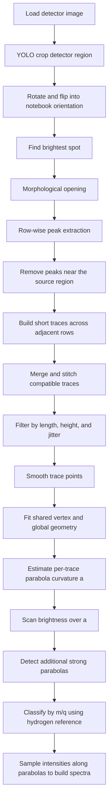

# Lines-Merger Workflow

This note summarizes the lower-level helper stages behind the Thomson parabola workflow, with example outputs generated from `detector_image2.png`. The cleaned `lines-merger-prep2.ipynb` notebook now uses the packaged `oblisk` entrypoints directly; this document remains the stage-by-stage reference for the same underlying analysis path.

## Block Scheme

## Example Run On `detector_image2.png`

This run followed the underlying stage-by-stage workflow directly.

- YOLO crop: no detector box found, so the full image was used
- Brightest spot after re-orientation: `(103, 95)`
- Row range scanned for peaks: `0..image_height`
- Traces after `build_lines()`: `11`
- Traces after `merge_lines()`: `6`
- Traces after smoothing: `6`
- Fitted geometry: `x0=97.30`, `y0=98.90`, `theta=-0.0023`, `gamma=-0.00144`, `delta=0.00004`
- Peaks found in curvature scan: `7`

## Generated Example Images

### 1. Preprocessing

The red marker is the brightest spot; the cyan line is the row where peak extraction starts.

### 2. Initial Trace Building

These are the raw line candidates formed by linking row-wise peaks.

### 3. Merged Traces

After predictive merging, stitching, and quality filtering, the line set becomes much cleaner.

### 4. Smoothed Traces

Each surviving trace is locally cleaned and smoothed before the global parabola fit.

### 5. Shared-Geometry Fit

Solid curves are the extracted traces; dashed curves are the fitted analytical parabolas.

### 6. Curvature Scan

The pipeline then scans the parabola curvature parameter `a` and looks for bright maxima.

### 7. Parabolas Recovered From The Scan

These are the analytical parabolas corresponding to the detected score peaks.

## Short Version

In practice, the algorithm does three big things:

1. Clean the image and convert bright trace pixels into row-wise peaks.
2. Turn those peaks into consistent trace polylines and fit a shared parabola geometry.
3. Use the fitted geometry for curvature search, species labeling, and spectrum extraction.
